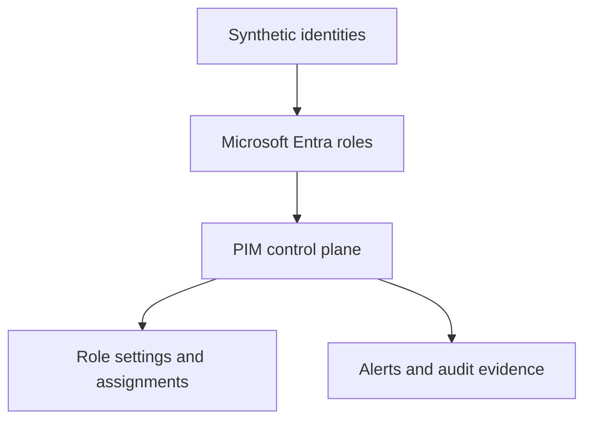

# Microsoft Entra Privileged Identity Management

This repository documents a synthetic hands-on implementation of Microsoft Entra Privileged Identity Management (PIM). The project demonstrates how privileged access can be discovered, assessed, governed, monitored, and validated without presenting the work as a production deployment.

## Current release

Milestone 1 establishes the PIM readiness and security baseline for Microsoft Entra roles. No role assignments or role settings were changed during this milestone.

## Milestone 1 objectives

- Confirm that PIM is available for the controlled tenant.
- Review privileged-role exposure and permanent assignments.
- Capture the initial PIM security alerts.
- Record the default settings of selected Microsoft Entra roles.
- Establish evidence-integrity and privacy controls before remediation.

## Baseline findings

| Area | Observation | Milestone 1 disposition |
| --- | --- | --- |
| PIM readiness | PIM for Microsoft Entra roles was available and accessible. | Validated |
| Global Administrator exposure | Four active permanent Global Administrator assignments were reported. | Recorded for later remediation and exception review |
| Activation security | Directory Readers was reported as not requiring MFA for activation. | Recorded as a Medium PIM alert |
| Service principals | Discovery and insights reported zero service principals with privileged-role assignments. | Recorded |
| Role settings | The reviewed role settings were unmodified defaults. | Baseline captured before changes |

The PIM dashboard findings represent the state observed during the controlled review. They do not replace a complete Microsoft Graph export or formal access certification.

## Operating model



## Repository structure

| Folder | Purpose |
| --- | --- |
| `architecture` | PIM scope, trust boundaries, and operating model |
| `data` | Structured findings and evidence-integrity manifest |
| `docs` | Milestone implementation and validation records |
| `policies` | Baseline privileged-access control requirements |
| `runbooks` | Repeatable operational review procedures |
| `screenshots` | Approved technical evidence |
| `scripts` | Read-only local validation scripts |

The local `temporary` folder is excluded from Git and is not part of the repository release.

## Evidence

| File | Demonstrates |
| --- | --- |
| `m01-02-pim-discovery-insights-baseline.png` | Discovery and insights baseline |
| `m01-03-pim-security-alerts-baseline.png` | Initial PIM alert state |
| `m01-04-pim-mfa-alert-directory-readers.png` | Directory Readers MFA alert detail |
| `m01-06-pim-role-settings-unmodified-baseline.png` | Unmodified Microsoft Entra role settings |
| `m01-07-pim-directory-readers-default-settings.png` | Directory Readers default settings |
| `m01-08-pim-global-admin-default-settings.png` | Global Administrator default activation and assignment settings |
| `m01-09-pim-global-admin-default-notifications.png` | Global Administrator default notification settings |

Screenshots containing tenant-specific identity details were excluded from this release.

## Validation

Run the following script from Windows PowerShell:

```powershell
.\scripts\01-Test-Milestone01Evidence.ps1
```

The script performs read-only checks for required files, screenshot hashes, PowerShell syntax, privacy terms, and the `temporary` Git exclusion.

## Microsoft documentation

- [What is Microsoft Entra Privileged Identity Management?](https://learn.microsoft.com/en-us/entra/id-governance/privileged-identity-management/pim-configure)
- [Plan a Privileged Identity Management deployment](https://learn.microsoft.com/en-us/entra/id-governance/privileged-identity-management/pim-deployment-plan)
- [Security alerts for Microsoft Entra roles in PIM](https://learn.microsoft.com/en-us/entra/id-governance/privileged-identity-management/pim-how-to-configure-security-alerts)
- [Configure Microsoft Entra role settings in PIM](https://learn.microsoft.com/en-us/entra/id-governance/privileged-identity-management/pim-how-to-change-default-settings)
- [Microsoft Entra ID Governance licensing fundamentals](https://learn.microsoft.com/en-us/entra/id-governance/licensing-fundamentals)

