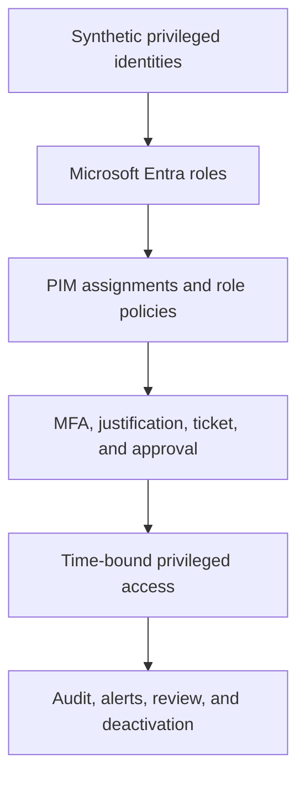

# Microsoft Entra Privileged Identity Management

## Implementation status

**Status: In progress — Milestones 1, 2, and 3 complete.** Milestone 1 establishes
the Microsoft Entra Privileged Identity Management (PIM) readiness and security
baseline. Milestone 2 remediates the first baseline alert and validates a
governed, time-bound User Administrator activation from assignment through
deactivation. Milestone 3 hardens Global Administrator, replaces routine
standing access with approval-controlled eligibility, and preserves two
governed emergency-access exceptions. Later milestones remain pending and are
identified in the delivery roadmap below.

This controlled synthetic implementation demonstrates privileged-access
governance for Microsoft Entra roles. It progresses from
read-only discovery through role-specific policy hardening, just-in-time
activation, approval, emergency-access governance, monitoring, and final
operational assurance.

This is a hands-on laboratory implementation. It does not claim an
organization-wide production deployment.

## Executive overview

| Area | Current state |
| --- | --- |
| Business problem | Permanent and weakly governed privileged access increases the impact of identity compromise and reduces accountability |
| Platform | Microsoft Entra ID with PIM for Microsoft Entra roles |
| Controlled identities | Synthetic administration, approver, eligible-role, and emergency-access identities |
| Implemented scope | Milestones 1–3: readiness, baseline assessment, role-policy remediation, eligible assignment, approval-controlled activation, standing-access reduction, emergency-access exceptions, audit, and alert validation |
| Current tenant progress | Milestone 3 complete; Milestone 4 configuration changes have not started |
| Recovery boundary | Two separately governed cloud-only emergency-access identities retain permanent active Global Administrator as documented recovery exceptions |
| Evidence boundary | Retained screenshots exclude complete tenant UPNs, personal email addresses, authentication secrets, and tenant configuration identifiers |
| Final target | A validated least-privilege PIM operating model with time-bound elevation, approval, monitoring, lifecycle controls, and operational handover |

## Business scenario and objective

Standing privileged access remains continuously available to an identity and
therefore to an attacker who compromises it. Default PIM settings may also lack
the activation controls appropriate for a role's impact.

This implementation demonstrates how to:

- identify permanent and high-impact privileged assignments;
- establish a trustworthy pre-change baseline;
- define role-specific activation and assignment controls;
- prefer eligible, time-bound access over routine standing privilege;
- require MFA, justification, ticket information, and approval where appropriate;
- preserve separately governed emergency access before reducing Global
  Administrator assignments;
- validate the request, approval, activation, use, deactivation, and audit
  sequence; and
- convert portal configuration into a repeatable operational process.

## Architecture and control flow

The detailed trust boundaries, responsibilities, and privileged-access design
principles are documented in the
[PIM Governance Operating Model](architecture/01-pim-governance-operating-model.md).
The Milestone 2 request and approval path is documented in the
[Eligible Access and Activation Flow](architecture/02-pim-eligible-access-and-activation-flow.md).
The Global Administrator assignment and emergency-recovery design is documented
in the [Global Administrator Governance Model](architecture/03-global-administrator-governance-model.md).

## Engineering scope

- PIM readiness and licensing availability
- Discovery and insights for Microsoft Entra privileged roles
- PIM security-alert assessment and remediation validation
- Role-specific activation, assignment, and notification settings
- Eligible and time-bound Microsoft Entra role assignments
- MFA, justification, ticket, and approval controls
- Global Administrator standing-access reduction and emergency-access exceptions
- PIM for Groups and controlled privileged-group membership
- Activation, deactivation, expiration, renewal, extension, and removal lifecycle
- PIM audit evidence, monitoring, operational review, and recovery procedures

Azure resource roles, production-scale privileged populations, and entitlement
management are outside the current implementation scope.

## Delivery roadmap

| Milestone | Principal outcome | Status |
| ---: | --- | --- |
| 1 | PIM readiness, privileged-role discovery, security alerts, and pre-change role-policy baseline | **Complete** |
| 2 | Directory Readers MFA remediation and end-to-end User Administrator eligible activation, approval, use, audit, and deactivation | **Complete** |
| 3 | Global Administrator policy hardening, standing-access reduction, and governed emergency-access exceptions | **Complete** |
| 4 | PIM for Groups and controlled privileged-group membership | Not started |
| 5 | Privileged assignment lifecycle validation covering expiration, renewal, extension, and removal decisions | Not started |
| 6 | PIM alerts, audit monitoring, periodic review, escalation, and recovery operations | Not started |
| 7 | Integrated privileged-access scenario, final assurance, limitations, and operational handover | Not started |

## Milestone 1: readiness and security baseline

Milestone 1 was observational. No role setting, assignment, alert, licence,
identity, group, or authentication configuration was changed during baseline
collection.

### Baseline findings

| Area | Observation | Milestone 1 disposition |
| --- | --- | --- |
| PIM readiness | PIM for Microsoft Entra roles was available and accessible | Validated |
| Global Administrator exposure | Four active permanent Global Administrator assignments were reported | Recorded for later assignment and emergency-access review |
| Activation security | Directory Readers was reported as not requiring MFA for activation | Recorded as a Medium PIM alert |
| Service principals | Discovery and insights reported zero service principals with privileged-role assignments | Recorded as a portal observation |
| Role settings | The reviewed role settings were marked as unmodified | Baseline captured before remediation |

The portal observations do not replace a complete Microsoft Graph role export
or formal access certification.

### Milestone 1 evidence

| Evidence | Demonstrates |
| --- | --- |
| [Discovery and insights baseline](screenshots/m01-02-pim-discovery-insights-baseline.png) | Initial privileged-assignment recommendations |
| [PIM security-alert baseline](screenshots/m01-03-pim-security-alerts-baseline.png) | Initial alert names and counts |
| [Directory Readers MFA alert](screenshots/m01-04-pim-mfa-alert-directory-readers.png) | Role identified by the activation-MFA alert |
| [Unmodified role-settings inventory](screenshots/m01-06-pim-role-settings-unmodified-baseline.png) | Pre-change Microsoft Entra role-settings state |
| [Directory Readers default settings](screenshots/m01-07-pim-directory-readers-default-settings.png) | Original activation and assignment controls |
| [Global Administrator default settings](screenshots/m01-08-pim-global-admin-default-settings.png) | Original activation and assignment controls |
| [Global Administrator default notifications](screenshots/m01-09-pim-global-admin-default-notifications.png) | Original notification configuration |

Screenshots containing tenant-specific identities or user principal names were
not retained.

## Milestone 2: eligible access and activation control

Milestone 2 moved from observation to controlled remediation. Directory Readers
was updated to require MFA during activation. User Administrator was then
hardened and tested through a complete eligible-access workflow.

### Implemented controls

| Area | Implemented state | Validation |
| --- | --- | --- |
| Directory Readers | Azure MFA required during activation; unrelated settings retained | Post-change policy evidence and PIM alert rescan |
| User Administrator activation | Two-hour maximum, Azure MFA, justification, ticket information, and approval by two designated members | Hardened-settings evidence and pending approval request |
| User Administrator assignment | Permanent eligible and permanent active assignments disabled; eligible assignments expire after six months; active assignments expire after one month | Hardened-settings evidence |
| Eligible access | One direct, directory-scoped eligible assignment created from 15 September 2026 through 14 March 2027 | Eligible-role evidence |
| Privileged operation | A disabled, unlicensed synthetic validation identity was created and then deleted | Operator validation during the active window; no credentials retained |
| Session closure | User Administrator was manually deactivated before its two-hour maximum elapsed | Active-state and audit-history evidence |
| Alert outcome | The activation-MFA alert cleared; the separate Global Administrator count alert remained open | Post-remediation alert evidence |

### Milestone 2 evidence

| Evidence | Demonstrates |
| --- | --- |
| [Directory Readers MFA enforced](screenshots/m02-01-pim-directory-readers-mfa-enforced.png) | Azure MFA enabled for Directory Readers activation |
| [User Administrator default settings](screenshots/m02-02-pim-user-administrator-default-settings.png) | Pre-change activation and assignment baseline |
| [User Administrator hardened settings](screenshots/m02-03-pim-user-administrator-hardened-settings.png) | Two-hour activation and strengthened activation and assignment controls |
| [Eligible role available](screenshots/m02-04-pim-eligible-role-activation-available.png) | User Administrator eligibility and Activate action |
| [Activation request pending](screenshots/m02-05-pim-user-administrator-activation-request-pending.png) | Approval gate prevented immediate elevation |
| [Active assignment](screenshots/m02-06-pim-user-administrator-active-assignment.png) | Approved, time-bound role activation |
| [PIM audit history](screenshots/m02-07-pim-user-administrator-audit-history.png) | Assignment, request, approval, activation, and deactivation sequence |
| [Alerts after remediation](screenshots/m02-08-pim-alerts-after-mfa-remediation.png) | MFA alert resolved and unrelated Global Administrator alert retained |

Three exploratory files prefixed `m02-review-` were not retained because they
add no unique control evidence.

## Milestone 3: Global Administrator governance

Milestone 3 reduced routine standing Global Administrator access while
preserving two separately validated emergency-recovery paths.

### Implemented controls

| Area | Implemented state | Validation |
| --- | --- | --- |
| Global Administrator activation | One-hour maximum with Azure MFA, justification, ticket information, and independent approval | Hardened-settings and pending-request evidence |
| Routine administration | Permanent active assignment replaced by a direct eligible assignment expiring after six months | Assignment inventory and PIM audit |
| Personal standing access | Global Administrator assignment removed without deleting the identity | PIM audit history |
| Emergency recovery | Two dedicated identities retained as permanent active Global Administrators | Independent sign-in and assignment validation; identity-bearing screens excluded |
| Session closure | Tested Global Administrator activation manually deactivated before its maximum duration | Active-state and audit evidence |
| Alert outcome | Initial stale result reconciled against authoritative assignments; completed scan returned no results | Final PIM Alerts evidence |

### Milestone 3 evidence

| Evidence | Demonstrates |
| --- | --- |
| [Global Administrator hardened settings](screenshots/m03-01-pim-global-administrator-hardened-settings.png) | One-hour activation and strengthened activation and assignment controls |
| [Activation request pending](screenshots/m03-02-pim-global-administrator-activation-request-pending.png) | Approval gate prevented immediate Global Administrator elevation |
| [Active assignment](screenshots/m03-03-pim-global-administrator-active-assignment.png) | Approved one-hour Global Administrator activation |
| [Privacy-redacted PIM audit history](screenshots/m03-04-pim-global-administrator-audit-history.png) | Policy, assignment, approval, activation, removal, and deactivation events |
| [Alerts after remediation](screenshots/m03-05-pim-alerts-after-global-administrator-remediation.png) | Completed PIM alert scan returned no results |

Identity-bearing assignment details and the transient stale-alert detail were
not retained.

## Documentation map

| Area | Artifact |
| --- | --- |
| Architecture and trust boundaries | [PIM Governance Operating Model](architecture/01-pim-governance-operating-model.md) |
| Eligible-access sequence | [Eligible Access and Activation Flow](architecture/02-pim-eligible-access-and-activation-flow.md) |
| Milestone implementation record | [PIM Readiness and Security Baseline](docs/01-milestone-01-pim-readiness-and-baseline.md) |
| Testing and exit criteria | [Milestone 1 Test and Validation Record](docs/02-milestone-01-test-and-validation-record.md) |
| Baseline findings | [Milestone 1 Baseline Findings](data/01-milestone-01-baseline-findings.csv) |
| Control requirements | [PIM Baseline Control Requirements](policies/01-pim-baseline-control-requirements.md) |
| Operational procedure | [PIM Readiness and Alert Review Runbook](runbooks/01-review-pim-readiness-and-alerts.md) |
| Milestone 2 implementation record | [Eligible Access Remediation](docs/03-milestone-02-eligible-access-remediation.md) |
| Milestone 2 testing and exit criteria | [Milestone 2 Test and Validation Record](docs/04-milestone-02-test-and-validation-record.md) |
| Milestone 2 control results | [Milestone 2 Control Validation](data/03-milestone-02-control-validation.csv) |
| Eligible-access standard | [PIM Eligible Access Control Standard](policies/02-pim-eligible-access-control-standard.md) |
| Activation procedure | [PIM Eligible Role Activation Runbook](runbooks/02-operate-pim-eligible-role-activation.md) |
| Global Administrator design | [Global Administrator Governance Model](architecture/03-global-administrator-governance-model.md) |
| Milestone 3 implementation record | [Global Administrator Remediation](docs/05-milestone-03-global-administrator-remediation.md) |
| Milestone 3 testing and exit criteria | [Milestone 3 Test and Validation Record](docs/06-milestone-03-test-and-validation-record.md) |
| Milestone 3 control results | [Milestone 3 Control Validation](data/05-milestone-03-control-validation.csv) |
| Global Administrator standard | [Global Administrator and Emergency Access Standard](policies/03-global-administrator-and-emergency-access-standard.md) |
| Global Administrator procedure | [Global Administrator Operations Runbook](runbooks/03-operate-global-administrator-access.md) |

## Security and engineering controls

- No passwords, access tokens, authentication secrets, personal email
  addresses, or tenant-specific user principal names are retained.
- Baseline evidence was captured before remediation.
- Exploratory and identity-bearing screenshots were not retained.
- The requester and approver functions were separated for the tested activation.
- The elevated role was activated only for a bounded task and manually
  deactivated when the task ended.
- Emergency-access identities are separated from routine administration,
  independently validated, and retained as documented permanent exceptions.
- Later control changes require explicit test outcomes, rollback criteria, and
  post-change evidence.

## Technical documentation structure

| Path | Purpose |
| --- | --- |
| `architecture/` | PIM scope, trust boundaries, responsibilities, and operating model |
| `data/` | Structured baseline findings and control-validation results |
| `docs/` | Milestone implementation and validation records |
| `policies/` | Privileged-access control requirements and role-policy decisions |
| `runbooks/` | Repeatable review, activation, recovery, and monitoring procedures |
| `screenshots/` | Approved numbered technical evidence |

## Current limitations and production improvements

- The implementation uses a small controlled synthetic tenant population.
- Milestone 1 portal discovery is not a substitute for a complete Microsoft
  Graph inventory or formal access review.
- The controlled User Administrator task validates the elevation path at lab
  scale; it does not replace production change approval or representative user
  acceptance testing.
- Emergency-access operability was validated at lab scale; production use would
  require independent monitoring, documented ownership, controlled credential
  custody, and recurring recovery exercises.
- Later milestones must validate assignment lifecycle, monitoring, escalation,
  and recovery rather than relying only on portal configuration.
- Production adoption would require representative scale, formal ownership,
  change approval, periodic access certification, independent emergency-access
  monitoring, licence continuity, and integration with enterprise ticketing and
  security operations.

## Authoritative Microsoft references

- [What is Microsoft Entra Privileged Identity Management?](https://learn.microsoft.com/en-us/entra/id-governance/privileged-identity-management/pim-configure)
- [Plan a Privileged Identity Management deployment](https://learn.microsoft.com/en-us/entra/id-governance/privileged-identity-management/pim-deployment-plan)
- [Security alerts for Microsoft Entra roles in PIM](https://learn.microsoft.com/en-us/entra/id-governance/privileged-identity-management/pim-how-to-configure-security-alerts)
- [Configure Microsoft Entra role settings in PIM](https://learn.microsoft.com/en-us/entra/id-governance/privileged-identity-management/pim-how-to-change-default-settings)
- [Assign Microsoft Entra roles in PIM](https://learn.microsoft.com/en-us/entra/id-governance/privileged-identity-management/pim-how-to-add-role-to-user)
- [Activate Microsoft Entra roles in PIM](https://learn.microsoft.com/en-us/entra/id-governance/privileged-identity-management/pim-how-to-activate-role)
- [Approve or deny requests for Microsoft Entra roles in PIM](https://learn.microsoft.com/en-us/entra/id-governance/privileged-identity-management/pim-approval-workflow)
- [View audit history for Microsoft Entra roles in PIM](https://learn.microsoft.com/en-us/entra/id-governance/privileged-identity-management/pim-how-to-use-audit-log)
- [Manage emergency-access accounts](https://learn.microsoft.com/en-us/entra/identity/role-based-access-control/security-emergency-access)
- [Microsoft Entra ID Governance licensing fundamentals](https://learn.microsoft.com/en-us/entra/id-governance/licensing-fundamentals)
