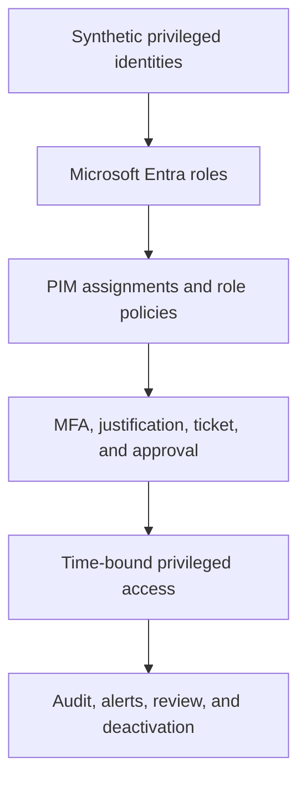

# Microsoft Entra Privileged Identity Management

## Implementation status

**Status: In progress — Milestone 1 published.** Milestone 1 establishes the
Microsoft Entra Privileged Identity Management (PIM) readiness and security
baseline. Milestone 2 tenant activities are complete, but their documentation,
evidence package, and release validation are not yet published. Later milestones
remain pending and are identified in the delivery roadmap below.

This repository documents a controlled synthetic implementation of privileged
access governance for Microsoft Entra roles. The project progresses from
read-only discovery through role-specific policy hardening, just-in-time
activation, approval, emergency-access governance, monitoring, and final
operational assurance.

The repository represents a hands-on laboratory. It does not claim an
organization-wide production deployment or production IAM employment
experience.

## Executive overview

| Area | Current state |
| --- | --- |
| Business problem | Permanent and weakly governed privileged access increases the impact of identity compromise and reduces accountability |
| Platform | Microsoft Entra ID with PIM for Microsoft Entra roles |
| Controlled identities | Synthetic administration, approver, eligible-role, and emergency-access identities |
| Current public release | Milestone 1 readiness, privileged-access discovery, security alerts, role-policy baselines, and evidence controls |
| Current tenant progress | Milestone 2 role-policy remediation and a controlled User Administrator activation workflow completed; public release pending |
| Recovery boundary | Two separately governed cloud-only emergency-access identities are retained for later Global Administrator remediation |
| Evidence boundary | Only approved screenshots without tenant-specific identity details are published |
| Final target | A validated least-privilege PIM operating model with time-bound elevation, approval, monitoring, lifecycle controls, and operational handover |

## Business scenario and objective

Standing privileged access remains continuously available to an identity and
therefore to an attacker who compromises it. Default PIM settings may also lack
the activation controls appropriate for a role's impact.

This project demonstrates how to:

- identify permanent and high-impact privileged assignments;
- establish a trustworthy pre-change baseline;
- define role-specific activation and assignment controls;
- prefer eligible, time-bound access over routine standing privilege;
- require MFA, justification, ticket information, and approval where appropriate;
- preserve separately governed emergency access before reducing Global
  Administrator assignments;
- validate the request, approval, activation, use, deactivation, and audit
  sequence; and
- convert portal configuration into a repeatable operational process.

## Architecture and control flow



The detailed trust boundaries, responsibilities, and privileged-access design
principles are documented in the
[PIM Governance Operating Model](architecture/01-pim-governance-operating-model.md).

## Engineering scope

- PIM readiness and licensing availability
- Discovery and insights for Microsoft Entra privileged roles
- PIM security-alert assessment and remediation validation
- Role-specific activation, assignment, and notification settings
- Eligible and time-bound Microsoft Entra role assignments
- MFA, justification, ticket, and approval controls
- Global Administrator standing-access reduction and emergency-access exceptions
- PIM for Groups and controlled privileged-group membership
- Activation, deactivation, expiration, renewal, extension, and removal lifecycle
- PIM audit evidence, monitoring, operational review, and recovery procedures
- Evidence integrity, privacy review, and deterministic repository validation

Azure resource roles, production-scale privileged populations, and entitlement
management are outside the current project scope.

## Delivery roadmap

| Milestone | Principal outcome | Status |
| ---: | --- | --- |
| 0 | Repository foundation, controlled structure, privacy boundary, and release workflow | Complete |
| 1 | PIM readiness, privileged-role discovery, security alerts, and pre-change role-policy baseline | **Complete — published** |
| 2 | Directory Readers MFA remediation and end-to-end User Administrator eligible activation, approval, use, audit, and deactivation | **Tenant work complete — release pending** |
| 3 | Global Administrator policy hardening, standing-access reduction, and governed emergency-access exceptions | Not started |
| 4 | PIM for Groups and controlled privileged-group membership | Not started |
| 5 | Privileged assignment lifecycle validation covering expiration, renewal, extension, and removal decisions | Not started |
| 6 | PIM alerts, audit monitoring, periodic review, escalation, and recovery operations | Not started |
| 7 | Integrated privileged-access scenario, final assurance, limitations, and operational handover | Not started |

Milestone status distinguishes tenant implementation from public release. A
milestone is marked published only after its documentation, evidence,
validation, privacy review, and GitHub package have passed.

## Milestone 1: readiness and security baseline

Milestone 1 was observational. No role setting, assignment, alert, licence,
identity, group, or authentication configuration was changed during baseline
collection.

### Baseline findings

| Area | Observation | Milestone 1 disposition |
| --- | --- | --- |
| PIM readiness | PIM for Microsoft Entra roles was available and accessible | Validated |
| Global Administrator exposure | Four active permanent Global Administrator assignments were reported | Recorded for later assignment and emergency-access review |
| Activation security | Directory Readers was reported as not requiring MFA for activation | Recorded as a Medium PIM alert |
| Service principals | Discovery and insights reported zero service principals with privileged-role assignments | Recorded as a portal observation |
| Role settings | The reviewed role settings were marked as unmodified | Baseline captured before remediation |

The portal observations do not replace a complete Microsoft Graph role export
or formal access certification.

### Milestone 1 evidence

| Evidence | Demonstrates |
| --- | --- |
| [Discovery and insights baseline](screenshots/m01-02-pim-discovery-insights-baseline.png) | Initial privileged-assignment recommendations |
| [PIM security-alert baseline](screenshots/m01-03-pim-security-alerts-baseline.png) | Initial alert names and counts |
| [Directory Readers MFA alert](screenshots/m01-04-pim-mfa-alert-directory-readers.png) | Role identified by the activation-MFA alert |
| [Unmodified role-settings inventory](screenshots/m01-06-pim-role-settings-unmodified-baseline.png) | Pre-change Microsoft Entra role-settings state |
| [Directory Readers default settings](screenshots/m01-07-pim-directory-readers-default-settings.png) | Original activation and assignment controls |
| [Global Administrator default settings](screenshots/m01-08-pim-global-admin-default-settings.png) | Original activation and assignment controls |
| [Global Administrator default notifications](screenshots/m01-09-pim-global-admin-default-notifications.png) | Original notification configuration |

Screenshots containing tenant-specific identities or user principal names are
excluded from the public evidence set.

## Documentation map

| Area | Artifact |
| --- | --- |
| Architecture and trust boundaries | [PIM Governance Operating Model](architecture/01-pim-governance-operating-model.md) |
| Milestone implementation record | [PIM Readiness and Security Baseline](docs/01-milestone-01-pim-readiness-and-baseline.md) |
| Testing and exit criteria | [Milestone 1 Test and Validation Record](docs/02-milestone-01-test-and-validation-record.md) |
| Baseline findings | [Milestone 1 Baseline Findings](data/01-milestone-01-baseline-findings.csv) |
| Evidence hashes | [Milestone 1 Evidence Manifest](data/02-milestone-01-evidence-manifest.csv) |
| Control requirements | [PIM Baseline Control Requirements](policies/01-pim-baseline-control-requirements.md) |
| Operational procedure | [PIM Readiness and Alert Review Runbook](runbooks/01-review-pim-readiness-and-alerts.md) |
| Repository validation | [Milestone 1 Evidence Validator](scripts/01-Test-Milestone01Evidence.ps1) |

## Security and engineering controls

- No passwords, access tokens, authentication secrets, personal email
  addresses, or tenant-specific user principal names are stored in the public
  release.
- Baseline evidence was captured before remediation.
- Each approved screenshot has a recorded byte length and SHA-256 hash.
- Exploratory and identity-bearing screenshots are excluded from GitHub.
- Emergency-access identities are separated from routine administration and
  must be validated before Global Administrator assignments are reduced.
- Later control changes require explicit test outcomes, rollback criteria, and
  post-change evidence before publication.
- The local `temporary` directory is excluded from version control.

## Repository structure

| Path | Purpose |
| --- | --- |
| `architecture/` | PIM scope, trust boundaries, responsibilities, and operating model |
| `data/` | Structured findings and evidence-integrity manifests |
| `docs/` | Milestone implementation and validation records |
| `policies/` | Privileged-access control requirements and role-policy decisions |
| `runbooks/` | Repeatable review, activation, recovery, and monitoring procedures |
| `screenshots/` | Approved numbered technical evidence |
| `scripts/` | Read-only repository and evidence-validation scripts |
| `temporary/` | Local package staging only; excluded by [`.gitignore`](.gitignore) |

## Validation

Run the Milestone 1 validator from Windows PowerShell in the repository root:

```powershell
.\scripts\01-Test-Milestone01Evidence.ps1
```

The script performs read-only checks for required release files, screenshot
names and hashes, PowerShell syntax, prohibited identity wording, and the
`temporary` Git exclusion. It does not connect to Microsoft Entra ID or change
the tenant.

## Current limitations and production improvements

- The implementation uses a small controlled synthetic tenant population.
- Milestone 1 portal discovery is not a substitute for a complete Microsoft
  Graph inventory or formal access review.
- Later milestones must validate assignment lifecycle, monitoring, escalation,
  and recovery rather than relying only on portal configuration.
- Production adoption would require representative scale, formal ownership,
  change approval, periodic access certification, independent emergency-access
  monitoring, licence continuity, and integration with enterprise ticketing and
  security operations.

## Authoritative Microsoft references

- [What is Microsoft Entra Privileged Identity Management?](https://learn.microsoft.com/en-us/entra/id-governance/privileged-identity-management/pim-configure)
- [Plan a Privileged Identity Management deployment](https://learn.microsoft.com/en-us/entra/id-governance/privileged-identity-management/pim-deployment-plan)
- [Security alerts for Microsoft Entra roles in PIM](https://learn.microsoft.com/en-us/entra/id-governance/privileged-identity-management/pim-how-to-configure-security-alerts)
- [Configure Microsoft Entra role settings in PIM](https://learn.microsoft.com/en-us/entra/id-governance/privileged-identity-management/pim-how-to-change-default-settings)
- [Manage emergency-access accounts](https://learn.microsoft.com/en-us/entra/identity/role-based-access-control/security-emergency-access)
- [Microsoft Entra ID Governance licensing fundamentals](https://learn.microsoft.com/en-us/entra/id-governance/licensing-fundamentals)
