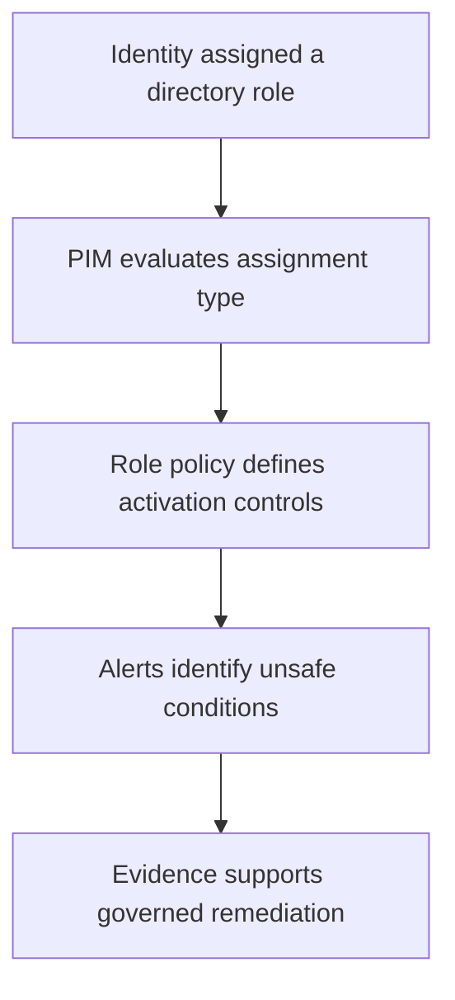

# PIM Governance Operating Model

## Purpose

This document defines the governance model used to assess Microsoft Entra privileged access before any remediation is performed.

## Scope

Milestone 1 covers:

- Microsoft Entra directory roles managed through PIM.
- PIM readiness and licensing availability.
- Discovery and insights.
- PIM security alerts.
- Default role activation, assignment, and notification settings.

Azure resource roles, PIM for Groups, workload identities, access reviews, and role remediation are outside this milestone.

## Control flow

## Responsibilities

| Function | Responsibility |
| --- | --- |
| Privileged-role administrator | Reviews assignments, settings, alerts, and audit evidence |
| Eligible role member | Activates only when privileged access is required |
| Approver | Confirms business need before protected-role activation |
| Emergency-access custodian | Maintains controlled access for recovery scenarios |
| Reviewer | Verifies evidence integrity, privacy, and control effectiveness |

## Trust boundaries

| Boundary | Risk | Expected control |
| --- | --- | --- |
| Permanent role assignment | Standing privilege can be misused or compromised | Prefer eligible and time-bound access, except approved emergency access |
| Role activation | An eligible identity can elevate privileges | Require proportionate MFA, justification, duration, and approval controls |
| Approval decision | Weak approval can become a rubber-stamp control | Use designated approvers and retain decision evidence |
| Emergency access | Strong controls can accidentally lock out all administrators | Maintain and test controlled cloud-only emergency accounts |
| Evidence handling | Screenshots can disclose tenant or identity data | Use approved filenames, integrity hashes, and privacy review |

## Design principles

1. Use least privilege and role-specific administration instead of routine Global Administrator access.
2. Prefer just-in-time eligible assignments over standing access.
3. Apply stronger activation controls to higher-impact roles.
4. Keep emergency-access accounts separate from routine administration.
5. Record baseline evidence before implementing changes.
6. Validate both the configured control and the resulting user workflow.

## Reference

[Plan a Privileged Identity Management deployment](https://learn.microsoft.com/en-us/entra/id-governance/privileged-identity-management/pim-deployment-plan)

