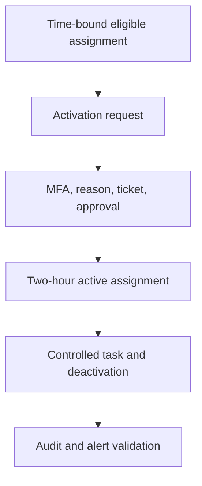

# PIM Eligible Access and Activation Flow

## Purpose

Define the trust boundaries and control sequence used in Milestone 2 to move a
synthetic User Administrator identity from time-bound eligibility to approved,
temporary privilege and back to a non-active state.

## Scope

This design covers Microsoft Entra PIM for Microsoft Entra roles at directory
scope. It includes role-policy configuration, eligible assignment, activation,
approval, controlled use, deactivation, audit, and alert validation.

Global Administrator remediation, PIM for Groups, Azure resource roles, access
reviews, and production log export remain outside Milestone 2.

## Actors and responsibilities

| Actor | Responsibility | Separation enforced |
| --- | --- | --- |
| Privileged-role administrator | Configure role policy and create the eligible assignment | Does not use the eligible identity for routine administration |
| Eligible role member | Request User Administrator only for an identified task | Cannot approve the same request |
| Designated approver | Evaluate and approve or deny the activation request | Uses a separate synthetic identity and records justification |
| PIM service | Enforce activation rules, provision temporary access, and record events | Removes the active assignment after deactivation or expiry |

## Control flow

## Trust boundaries

| Boundary | Primary risk | Applied control |
| --- | --- | --- |
| Eligibility creation | Eligibility becomes permanent or over-broad | Direct directory-scoped assignment with fixed start and end dates |
| Activation request | Access is elevated without sufficient context | MFA, justification, ticket information, and a two-hour maximum |
| Approval | Requester authorizes their own elevation | Separate designated approver identity |
| Privileged use | Privilege is used beyond the approved task | Disabled, unlicensed synthetic validation object and bounded test procedure |
| Session closure | Privilege remains active after work ends | Manual deactivation followed by audit verification |

## Role-policy decisions

### Directory Readers

Azure MFA was enabled for activation to remediate the PIM alert. Unrelated role
settings were retained.

### User Administrator

The activation maximum was reduced from eight hours to two. Azure MFA,
justification, ticket information, and approval were required. Two member
approvers were configured. Permanent eligible and permanent active assignments
were disabled; eligible assignments expire after six months and active
assignments after one month.

The one-month active-assignment limit governs administrator-created active
assignments. The tested self-activation remained constrained by the separate
two-hour activation maximum.

## Expected state transitions

| Sequence | Expected state |
| ---: | --- |
| 1 | User Administrator appears under eligible assignments with **Activate** |
| 2 | Submitted request appears as **Pending approval** |
| 3 | Designated approver records an approval decision |
| 4 | User Administrator appears under active assignments with **Deactivate** and an end time |
| 5 | Controlled privileged task completes without assigning licence or additional role |
| 6 | Manual deactivation removes current active privilege |
| 7 | Audit history records assignment, request, approval, activation, and deactivation |

## References

- [What is Microsoft Entra Privileged Identity Management?](https://learn.microsoft.com/en-us/entra/id-governance/privileged-identity-management/pim-configure)
- [Assign Microsoft Entra roles in PIM](https://learn.microsoft.com/en-us/entra/id-governance/privileged-identity-management/pim-how-to-add-role-to-user)
- [Activate Microsoft Entra roles in PIM](https://learn.microsoft.com/en-us/entra/id-governance/privileged-identity-management/pim-how-to-activate-role)
- [Approve or deny requests for Microsoft Entra roles in PIM](https://learn.microsoft.com/en-us/entra/id-governance/privileged-identity-management/pim-approval-workflow)
