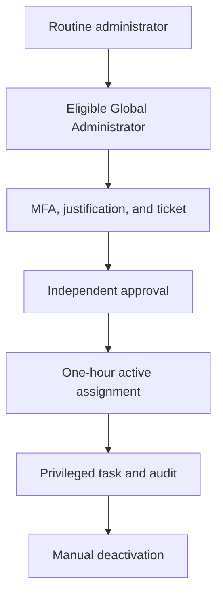

# Global Administrator Governance Model

## Purpose

This design separates routine privileged administration from emergency tenant
recovery. Routine Global Administrator access is eligible, time-bound, and
approval-controlled. Two dedicated emergency-access identities remain
permanently active as documented exceptions so tenant recovery does not depend
on the normal PIM activation path.

## Implemented identity model

| Identity function | Assignment state | Intended use |
| --- | --- | --- |
| Routine administration | Direct eligible Global Administrator assignment expiring after six months | Planned administration through PIM activation |
| Independent approver | Designated PIM approver | Review activation reason and ticket context; never approve its own request |
| Emergency access 1 | Direct permanent active Global Administrator | Tenant recovery when normal controls are unavailable |
| Emergency access 2 | Direct permanent active Global Administrator | Independent recovery path if the first emergency identity is unavailable |
| Personal identity | No Global Administrator assignment | Normal nonprivileged use only |

The two emergency identities are not routine administrator accounts. Their
standing privilege is a deliberate availability exception that requires
separate credential protection, monitoring, and periodic validation.

## Privileged-access flow

Emergency access bypasses this routine activation sequence only when the normal
administrative path is unavailable. Any emergency use must generate immediate
review and credential assurance.

## Global Administrator role policy

| Control | Implemented value |
| --- | --- |
| Maximum activation | 1 hour |
| Authentication on activation | Azure MFA required |
| Justification | Required |
| Ticket information | Required |
| Approval | Required |
| Approvers | Two designated member identities |
| Pre-approval custom extension | Not required |
| Post-approval custom extension | Not required |
| Permanent eligible assignment | Not allowed |
| Eligible assignment expiry | 6 months |
| Permanent active assignment | Allowed only to support emergency-access exceptions |
| MFA on active assignment | Required |
| Justification on active assignment | Required |

The role-level setting permits permanent active assignments because PIM policy
cannot express an exception for only the two emergency identities. Governance
therefore restricts that assignment type procedurally and through periodic
review.

## Safe transition sequence

The standing-access reduction followed a fail-safe order:

1. validate both emergency-access identities independently;
2. harden the Global Administrator role policy without removing access;
3. convert the routine administrator from permanent active to eligible;
4. test MFA, ticket, approval, activation, and deactivation;
5. remove Global Administrator from the personal identity;
6. confirm the final assignment inventory; and
7. rescan PIM alerts after directory and alert-processing convergence.

This sequence retained at least two known recovery paths throughout the change.

## Monitoring boundary

- Every routine activation must produce PIM request, approval, activation, and
  deactivation records.
- Emergency-account sign-ins and role use require high-priority monitoring.
- Emergency-access operability and control exclusions should be validated at
  least every 90 days and after relevant policy changes.
- The eligible assignment must be reviewed before its six-month expiration.
- PIM alert output is reconciled with the authoritative assignment inventory;
  stale alert results are never used alone to remove privileged access.

## References

- [Plan a Privileged Identity Management deployment](https://learn.microsoft.com/en-us/entra/id-governance/privileged-identity-management/pim-deployment-plan)
- [Manage emergency access accounts in Microsoft Entra ID](https://learn.microsoft.com/en-us/entra/identity/role-based-access-control/security-emergency-access)
- [Configure Microsoft Entra role settings in PIM](https://learn.microsoft.com/en-us/entra/id-governance/privileged-identity-management/pim-how-to-change-default-settings)
- [Best practices for Microsoft Entra roles](https://learn.microsoft.com/en-us/entra/identity/role-based-access-control/best-practices)
