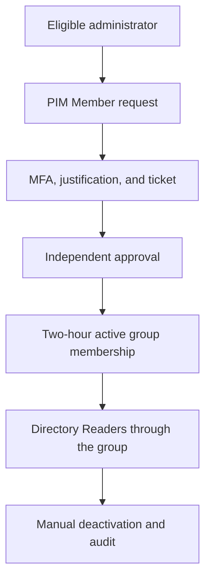

# PIM for Groups Just-in-Time Membership Model

## Purpose

This design uses Privileged Identity Management (PIM) for Groups to separate a
standing Microsoft Entra role assignment from the people who can use it. A
dedicated role-assignable security group holds Directory Readers, while an
administrator receives only time-bound eligibility for group membership.

The result is a reusable privileged-access boundary: the group remains bound to
the role, but no tested user receives that access until PIM policy, MFA,
justification, ticket information, and independent approval have been
satisfied.

## Implemented group model

| Component | Implemented state | Security purpose |
| --- | --- | --- |
| Group | `GG_PIM_Directory_Readers` | Dedicated boundary for governed Directory Readers access |
| Group type | Cloud security group with assigned membership | Supports controlled, explicit membership |
| Role assignability | Enabled | Allows the group to hold a Microsoft Entra role |
| Microsoft Entra role | Permanent active Directory Readers assignment to the group | Keeps the resource binding stable while user membership remains governed |
| Eligible member | One direct, time-bound Member assignment | Removes permanent user membership |
| Owner assignments | None | Avoids unnecessary standing group-management privilege |

The Conditional Access pilot group was not repurposed. Mixing Conditional
Access scope and privileged role membership would couple two independent
control boundaries and increase the impact of an incorrect membership change.

## Access flow

The group-to-role assignment is stable. The user's membership is the controlled
element and is removed when the activation is manually deactivated or reaches
its end time.

## Member policy

| Control | Implemented value |
| --- | --- |
| Maximum activation | 2 hours |
| Authentication on activation | Azure MFA required |
| Justification | Required |
| Ticket information | Required |
| Approval | Required |
| Approvers | Two designated member identities |
| Pre-approval custom extension | Not required |
| Post-approval custom extension | Not required |
| Permanent eligible assignment | Not allowed |
| Eligible assignment expiry | 6 months |
| Permanent active assignment | Not allowed |
| Active assignment expiry | 1 month |
| MFA on active assignment | Required |
| Justification on active assignment | Required |

Owner settings were left unchanged because the implemented access path uses
Member eligibility only and no owner assignment was created.

## Separation of duties

The eligible member submitted the activation request. A separate designated
approver reviewed and authorized it. The requester did not approve its own
request. The activated membership had a fixed two-hour end time and was
manually deactivated when the validation task finished.

## Evidence and authorization boundary

The assurance chain is based on four independent states:

1. Directory Readers is assigned to the dedicated role-assignable group.
2. The user holds a time-bound eligible Member assignment rather than active
   membership.
3. PIM records the request, approval, activation, and deactivation lifecycle.
4. Active membership exists only inside the approved activation window.

A portal check confirmed that directory information could be read during the
active window. That observation is supporting evidence only because ordinary
member users may already read some basic directory information under default
Microsoft Entra permissions. It is not used as the sole proof of authorization.

## Monitoring and review

- Review eligible membership before its six-month expiration.
- Investigate activation requests without a valid justification or ticket.
- Confirm that the requester and approver are different identities.
- Alert on unexpected active or permanent membership.
- Review changes to the group-to-role assignment as high-impact events.
- Preserve the request, approval, activation, deactivation, and group-membership
  audit sequence.

## References

- [Privileged Identity Management for Groups](https://learn.microsoft.com/en-us/entra/id-governance/privileged-identity-management/concept-pim-for-groups)
- [Configure PIM for Groups settings](https://learn.microsoft.com/en-us/entra/id-governance/privileged-identity-management/groups-role-settings)
- [Assign eligibility for a group](https://learn.microsoft.com/en-us/entra/id-governance/privileged-identity-management/groups-assign-member-owner)
- [Activate group membership or ownership](https://learn.microsoft.com/en-us/entra/id-governance/privileged-identity-management/groups-activate-roles)
- [Approve activation requests for group members and owners](https://learn.microsoft.com/en-us/entra/id-governance/privileged-identity-management/groups-approval-workflow)

