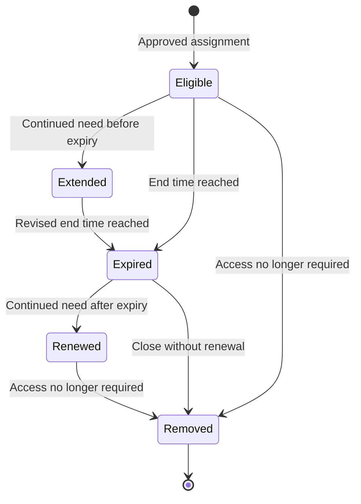

# Privileged Assignment Lifecycle Model

## Purpose

This model governs a privileged role assignment from initial approval through
extension, expiration, renewal, and final removal. It keeps access time-bound,
requires a fresh decision when access must continue, and preserves an auditable
record of each state transition.

The model applies to direct eligible Microsoft Entra role assignments. It does
not treat an expired assignment as active access and does not use renewal as a
substitute for periodic review.

## Lifecycle states

An extension updates an assignment that has not yet expired. A renewal restores
eligibility after expiration. Removal closes the access path when the business
need ends, regardless of whether the assignment is currently eligible or
expired.

## Decision controls

| Decision point | Required control | Expected state |
| --- | --- | --- |
| Initial assignment | Defined role, direct scope, eligible type, start time, end time, justification, and authorized administrator | Time-bound eligible |
| Extension | Request before expiry, confirmed continued need, bounded revised end time, and authorized approval | Eligible with a later end time |
| Expiration | No manual conversion to active or permanent access | Expired; no usable role eligibility |
| Renewal | Request after expiry, renewed business justification, bounded new end time, and authorized approval | Eligible again with a new end time |
| Removal | Confirm the exact role and identity, then remove eligibility when access is no longer required | No eligible or active assignment |
| Review | Correlate assignment changes, requests, approvals, automatic expiry, and removals | Complete successful audit sequence |

## Implemented control path

Two low-impact reader roles were used to exercise the lifecycle without
granting broad administrative capability:

| Role | Lifecycle exercised | Final disposition |
| --- | --- | --- |
| Directory Readers | Time-bound eligibility followed by a pre-expiry extension | Removed after validation |
| Reports Reader | Short time-bound eligibility, automatic expiration, approved renewal, and reinstatement | Removed after validation |

The existing User Administrator eligible assignment was outside this lifecycle
exercise and remained unchanged. Global Administrator emergency-access
assignments were also outside scope and remained governed by the documented
recovery exception.

## Separation of duties

The eligible user initiated extension and renewal requests. An authorized
administrator completed the approval decisions. The requester did not approve
its own requests. Approval established whether eligibility could continue; it
did not create a permanent assignment.

## Audit chain

The authoritative lifecycle record includes:

1. creation of the original time-bound eligible assignment;
2. the user-initiated extension or renewal request;
3. the approval decision;
4. the resulting assignment update or reinstatement;
5. automatic removal when a fixed end time is reached; and
6. administrator removal when access is no longer required.

Portal assignment views provide point-in-time state evidence. Resource audit
provides the chronological record used to reconcile those states.

## References

- [Assign Microsoft Entra roles in PIM](https://learn.microsoft.com/en-us/entra/id-governance/privileged-identity-management/pim-how-to-add-role-to-user)
- [Renew Microsoft Entra role assignments in PIM](https://learn.microsoft.com/en-us/entra/id-governance/privileged-identity-management/pim-how-to-renew-extend)
- [View audit history for Microsoft Entra roles in PIM](https://learn.microsoft.com/en-us/entra/id-governance/privileged-identity-management/pim-how-to-use-audit-log)
- [Configure Microsoft Entra role settings in PIM](https://learn.microsoft.com/en-us/entra/id-governance/privileged-identity-management/pim-how-to-change-default-settings)
