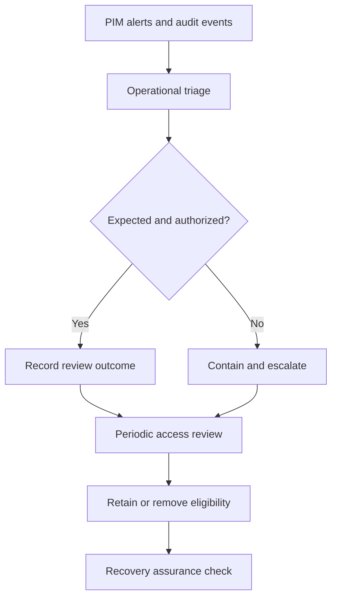

# Privileged Access Monitoring and Assurance Model

## Purpose

This model connects PIM alerts, audit evidence, periodic access review, recovery
access, and operational escalation. The objective is to detect control drift,
confirm that privileged eligibility remains justified, and preserve a tested
recovery path without introducing routine standing privilege.

## Assurance layers

| Layer | Control | Assurance outcome |
| --- | --- | --- |
| Prevent | Eligible, time-bound assignment and approval-controlled activation | Privilege is unavailable until a justified activation is approved |
| Detect | PIM alerts and Resource audit review | Misconfiguration and privileged lifecycle activity are visible |
| Review | Periodic access reviews | Continued eligibility receives an explicit human decision |
| Recover | Two dedicated emergency-access Global Administrators | Tenant recovery remains possible if normal administrative paths fail |
| Respond | Severity-based triage, containment, escalation, and evidence preservation | Findings receive a consistent operational disposition |

## Monitoring flow

## Trust boundaries

- Routine administrators use eligible assignments and do not use emergency
  identities for normal work.
- Reviewers make access-review decisions independently from the subject whose
  access is being reviewed.
- PIM portal state and audit records are authoritative for this lab; screenshots
  are supporting evidence rather than a substitute for retained service logs.
- Applying an access review enforces denied decisions. An all-approved review
  can remain displayed as **Complete** because no removal action is required.

## Recovery boundary

Two separately governed cloud-only identities retain permanent active Global
Administrator assignments as documented exceptions. They are excluded from
routine activation exercises. Their assignment presence is checked without
changing, activating, or using them.

## Escalation boundary

Unexpected Global Administrator activity, emergency-account use, failed or
repeated privileged activations, unexplained assignment changes, and high-risk
PIM alerts require immediate security escalation. Lower-risk configuration
findings are assigned an owner and remediation date and are tracked to closure.

