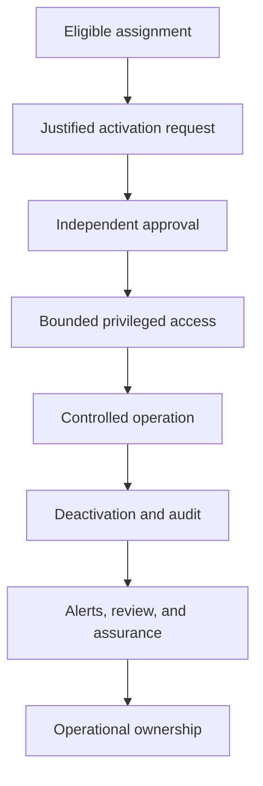

# Integrated PIM Assurance and Handover Model

## Purpose

This model consolidates the completed privileged-access controls into one
operational lifecycle. It connects assignment governance, approval-controlled
activation, privileged use, monitoring, recovery, and accountable handover.

## Integrated control path

## Control domains

| Domain | Implemented control | Primary assurance source |
| --- | --- | --- |
| Assignment | Routine privilege is eligible and time-bound | Assignment inventory and role settings |
| Activation | MFA, justification, ticket information, duration, and approval | PIM request and approval history |
| Separation of duties | Requester and approver are separate controlled identities | Approval record and audit events |
| Privileged use | Scope is limited to the approved task | Operator record and resulting state |
| Closure | Active access is manually deactivated after use | Active-assignment state and removal events |
| Monitoring | Alerts, audit, and access reviews are reconciled | PIM Alerts, Resource audit, and review decisions |
| Recovery | Two dedicated emergency-access identities remain available | Periodic assignment and sign-in assurance |

## Authority boundaries

- Routine operators may request only their existing eligible assignments.
- Approvers validate purpose and scope before granting activation.
- Privileged Access Administrators or Global Administrators own PIM policy and
  assignment administration.
- Security operations triages unexplained privileged events and emergency
  account use.
- Emergency-access identities are isolated from routine administration and
  excluded from normal activation workflows.

## Evidence hierarchy

Portal screenshots demonstrate selected implementation states. PIM assignment
state and audit records are the primary authorization evidence. A readable
directory page is only a functional observation because basic directory data
may also be visible through default member permissions.

## Handover outcome

The operating model is ready for controlled lab handover with documented
ownership, recurring activities, escalation conditions, evidence expectations,
known limitations, and production-improvement requirements.

