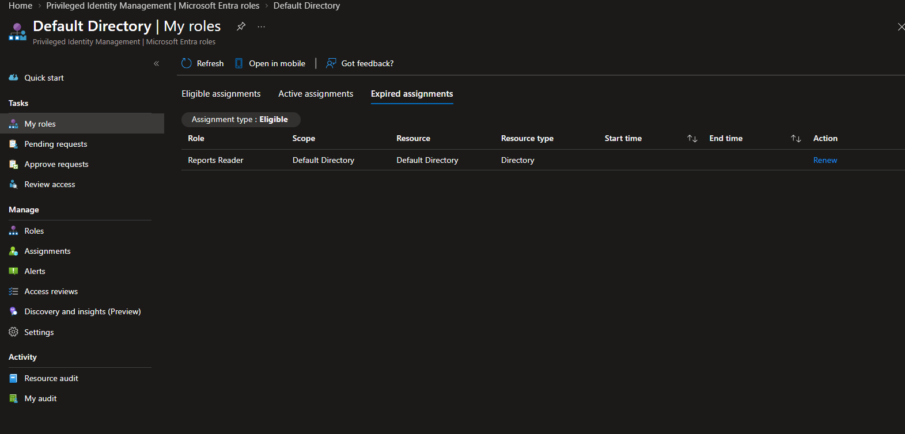
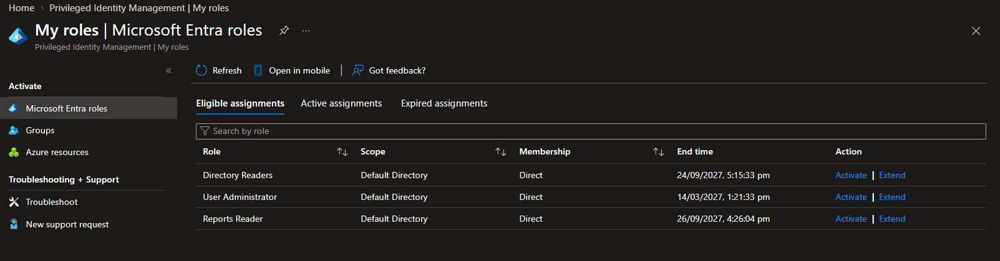
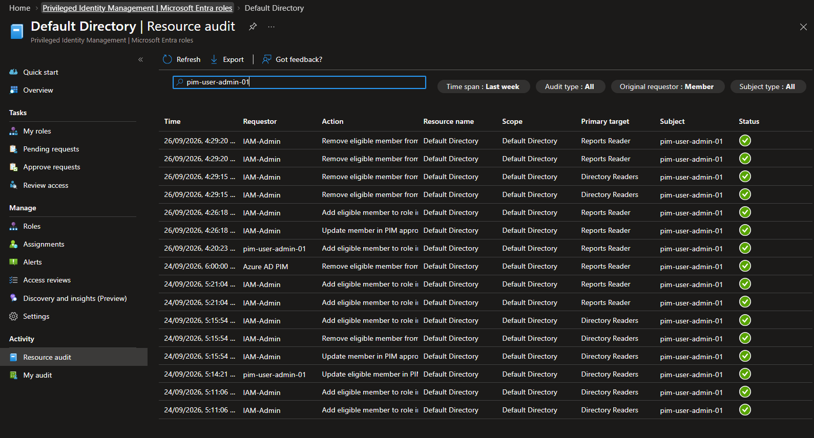

# Milestone 5: Privileged Assignment Lifecycle

## Objective

Validate the operational lifecycle of time-bound Microsoft Entra role
eligibility, including extension before expiration, automatic expiration,
renewal after expiration, independent approval, final removal, and audit
reconciliation.

## Starting condition

The controlled privileged user already held the User Administrator eligible
assignment established in Milestone 2. That assignment was not altered.
Milestone 5 used Directory Readers and Reports Reader as lower-impact roles for
the lifecycle exercise. The two documented emergency-access Global
Administrator assignments were outside scope and remained unchanged.

## Controlled assignments

| Role | Assignment | Lifecycle purpose |
| --- | --- | --- |
| Directory Readers | Direct, time-bound eligible | Validate a user-initiated extension before expiration |
| Reports Reader | Direct, time-bound eligible with a short initial end time | Validate automatic expiration and user-initiated renewal |

Neither role was assigned permanently or activated for administrative use as
part of this milestone.

## Extension test

The controlled user requested an extension of the Directory Readers eligible
assignment before it expired. A separate authorized administrator reviewed the
request and approved continued eligibility. The resulting assignment remained
eligible and received a revised end time of 24 September 2027 at 17:15:33.

This confirmed that continued access could be reviewed without converting the
assignment to active or permanent privilege.

## Expiration test

The Reports Reader eligible assignment had a fixed end time of 24 September
2026 at 18:00. It was intentionally left unextended. After the end time, PIM
displayed Reports Reader under **Expired assignments** with a **Renew** action.
Resource audit recorded automatic removal by the PIM service.

The expired entry was treated as historical and renewable state, not as active
or usable access.

## Renewal test

On 26 September 2026, the controlled user selected **Renew** for the expired
Reports Reader assignment and supplied a new business justification. The
request required approval. A separate authorized administrator approved it,
and Reports Reader returned to **Eligible assignments** with a new end time of
26 September 2027 at 16:26:04.

The renewal created a new bounded eligibility period. It did not create a
permanent assignment or activate the role.

## Final removal

After the extension and renewal paths were validated, the temporary Directory
Readers and Reports Reader eligible assignments were removed. The existing User
Administrator eligibility was retained. Emergency-access assignments and the
PIM for Groups configuration were not changed.

## Audit validation

Resource audit recorded successful lifecycle events for:

- creation of the original time-bound assignments;
- the Directory Readers extension request and approval;
- the Reports Reader automatic expiration;
- the Reports Reader renewal request and approval;
- reinstatement of Reports Reader eligibility; and
- final removal of the temporary Directory Readers and Reports Reader
  assignments.

The filtered audit view tied these events to the controlled identity and showed
successful status throughout the tested sequence.

## Outcome

Milestone 5 passed. The implementation demonstrated that privileged
eligibility can be extended before expiration, allowed to expire without
residual access, renewed after a fresh approval decision, and explicitly
removed when no longer required. Unrelated eligibility and documented recovery
access remained intact.

## Evidence

| Evidence | Demonstrates |
| --- | --- |
| [Expired Reports Reader assignment](../screenshots/m05-01-pim-reports-reader-expired-assignment.png) | Reports Reader is expired and offers renewal rather than active access |
| [Renewed Reports Reader assignment](../screenshots/m05-02-pim-reports-reader-renewed-assignment.png) | Reports Reader eligibility returned with a new bounded end time after approval |
| [Assignment lifecycle audit history](../screenshots/m05-03-pim-assignment-lifecycle-audit-history.png) | Extension, expiration, renewal, reinstatement, and removal events completed successfully |

## Evidence walkthrough

### Assignment lifecycle

## References

- [Renew Microsoft Entra role assignments in PIM](https://learn.microsoft.com/en-us/entra/id-governance/privileged-identity-management/pim-how-to-renew-extend)
- [Assign Microsoft Entra roles in PIM](https://learn.microsoft.com/en-us/entra/id-governance/privileged-identity-management/pim-how-to-add-role-to-user)
- [View audit history for Microsoft Entra roles in PIM](https://learn.microsoft.com/en-us/entra/id-governance/privileged-identity-management/pim-how-to-use-audit-log)
