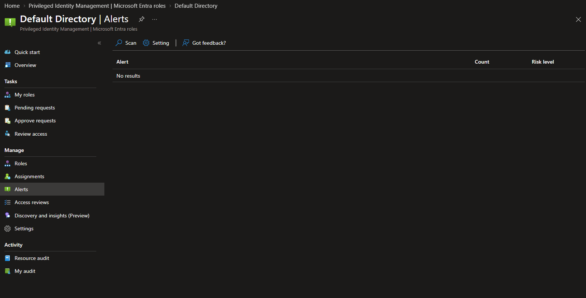
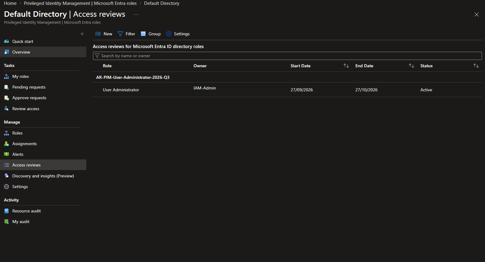
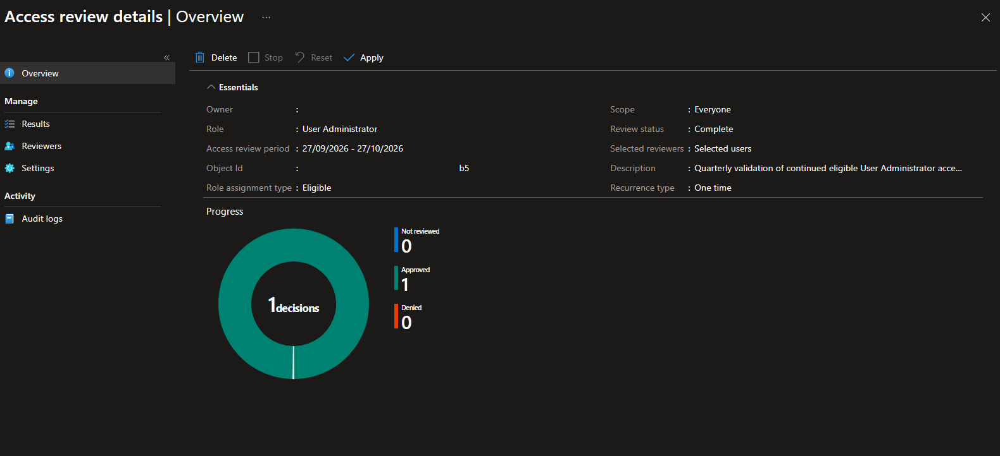
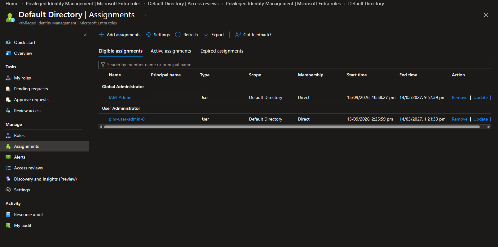
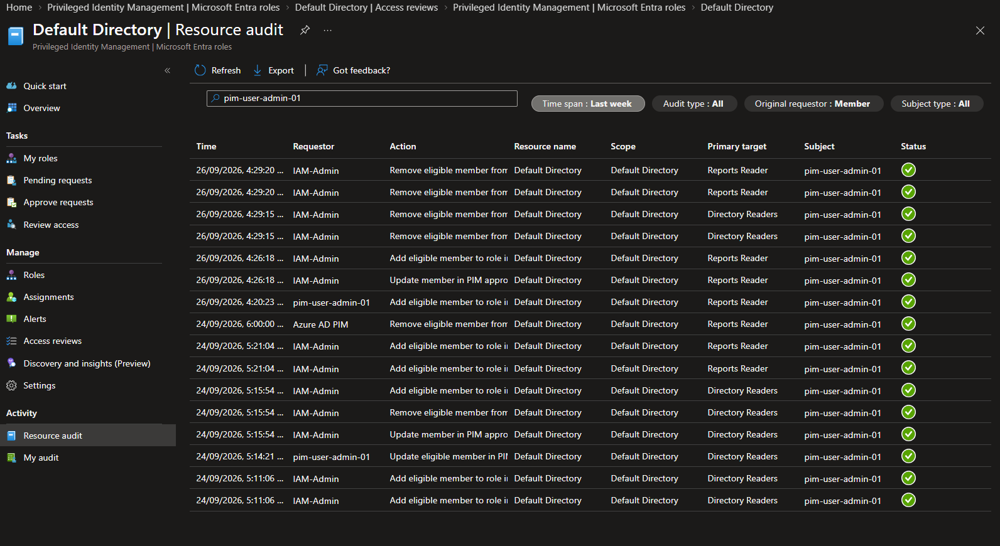

# Milestone 6: Monitoring and Operational Assurance

## Objective

Validate the operational controls that surround privileged access: PIM alert
review, audit monitoring, periodic access certification, recovery assurance,
escalation, and closure of temporary administrative elevation.

## Alert review

The Microsoft Entra roles PIM Alerts view was reviewed after the preceding
privileged-assignment lifecycle work. The current scan displayed **No results**.
This establishes a point-in-time operational result; it does not remove the
requirement for recurring review or independent audit reconciliation.

## Access review

A one-time review named `AR-PIM-User-Administrator-2026-Q3` was created for the
eligible User Administrator assignment. The controlled reviewer independently
approved continued eligibility for the controlled administration identity and
provided a business reason.

After the decision, the review was stopped and completed. The decision summary
showed one approved decision, zero denied decisions, and zero not reviewed. The
results were applied. The review remained displayed as **Complete**; because no
identity was denied, there was no assignment removal for PIM to perform.

## Post-review validation

The eligible-assignment inventory confirmed that the reviewed identity retained
direct, time-bound User Administrator eligibility through 14 March 2027. The
review did not convert the assignment to active or permanent access.

## Audit monitoring

Resource audit was filtered for the controlled privileged identity over the
previous week. The view displayed successful assignment lifecycle activity,
including PIM and directory events for Directory Readers and Reports Reader.
This reconciled the prior lifecycle exercise with the service audit trail.

## Recovery assurance

The Global Administrator active-assignment inventory contained two designated
emergency-access identities. Both remained listed as direct, permanent, active
assignments. They were not changed or used during the check.

## Session closure

The temporary Global Administrator activation used to administer the review was
deactivated after portal work finished. No routine standing Global
Administrator assignment was introduced.

## Outcome

Milestone 6 passed. Monitoring returned no current PIM alerts; the eligible User
Administrator assignment received an independent approval decision; the
time-bound assignment was retained without elevation; historical PIM activity
was visible in Resource audit; two emergency recovery assignments remained in
place; and temporary administrative elevation was closed.

## Evidence

| Evidence | Demonstrates |
| --- | --- |
| [PIM alerts operational review](../screenshots/m06-01-pim-alerts-operational-review.png) | Current PIM alert view returned no results |
| [Active access review](../screenshots/m06-02-pim-user-administrator-access-review-active.png) | User Administrator access review entered the active state |
| [Completed access-review decision](../screenshots/m06-03-pim-user-administrator-access-review-completed.png) | One approved decision, zero denied, and zero not reviewed |
| [Eligible assignment retained](../screenshots/m06-04-pim-user-administrator-eligible-retained.png) | Reviewed identity remained directly eligible and time-bound |
| [Operational audit review](../screenshots/m06-05-pim-operational-audit-review.png) | Successful privileged-assignment lifecycle activity was available for reconciliation |

## Evidence walkthrough

### Monitoring and access review

## References

- [Security alerts for Microsoft Entra roles in PIM](https://learn.microsoft.com/en-us/entra/id-governance/privileged-identity-management/pim-how-to-configure-security-alerts)
- [Create an access review of Microsoft Entra roles in PIM](https://learn.microsoft.com/en-us/entra/id-governance/privileged-identity-management/pim-create-roles-and-resource-roles-review)
- [Complete an access review of Microsoft Entra roles in PIM](https://learn.microsoft.com/en-us/entra/id-governance/privileged-identity-management/pim-complete-roles-and-resource-roles-review)
- [View audit history for Microsoft Entra roles in PIM](https://learn.microsoft.com/en-us/entra/id-governance/privileged-identity-management/pim-how-to-use-audit-log)
- [Manage emergency-access accounts](https://learn.microsoft.com/en-us/entra/identity/role-based-access-control/security-emergency-access)
