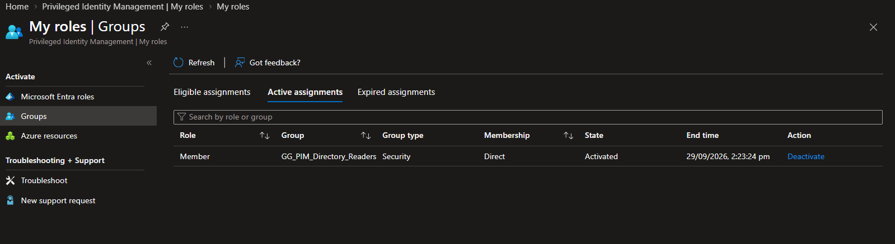
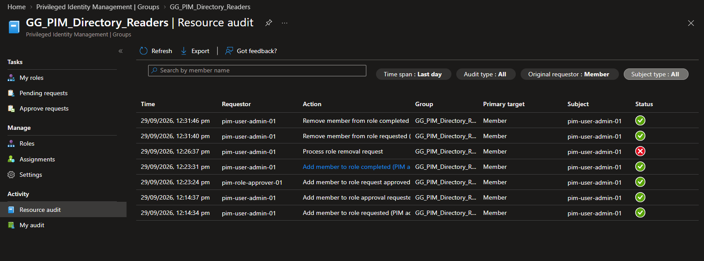
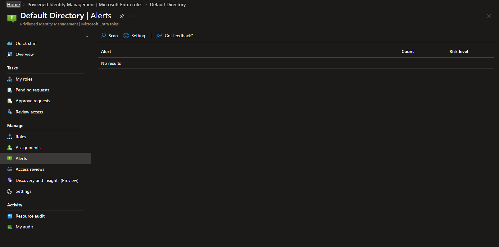

# Milestone 7: Integrated Assurance and Operational Handover

## Objective

Demonstrate the completed PIM operating model through a final integrated
scenario and consolidate the project for operational handover.

## Scenario

The controlled user requested activation of eligible Member access to the
dedicated `GG_PIM_Directory_Readers` role-assignable group. The request included
a bounded duration, business justification, and validation reference. A
separate authorized approver approved the request.

After approval, PIM displayed the direct Member assignment as **Activated** with
a fixed end time and a **Deactivate** action. The user performed a read-only
directory validation and made no directory, group, role, or identity change.

## Closure and audit reconciliation

The requester deactivated the group membership after the controlled task. The
audit trail recorded the request, approval request, approval, activation, and
removal sequence.

One role-removal processing event failed during the first deactivation attempt.
The requester retried through the supported portal workflow. The later removal
request and completion events succeeded, and the active membership disappeared.
The failed event is retained as evidence of transparent operational handling;
it did not leave residual privileged access.

## Final assurance

- The final PIM alert scan returned **No results**.
- Two emergency-access Global Administrator assignments remained active,
  direct, and permanent and were not changed or used.
- The temporary Global Administrator activation used for monitoring and
  assurance was deactivated.
- No permanent routine assignment was introduced.

## Operational handover

The completed documentation defines control ownership, recurring monitoring,
periodic access review, emergency-access assurance, escalation, evidence
requirements, rollback, and production-improvement priorities.

## Final project outcome

All seven milestones passed. The lab demonstrates a complete privileged-access
governance lifecycle: readiness assessment, role-policy hardening, eligible and
time-bound access, approval-controlled activation, Global Administrator
standing-access reduction, emergency recovery, PIM for Groups, assignment
lifecycle management, monitoring, access review, integrated validation, and
operational handover.

## Evidence

| Evidence | Demonstrates |
| --- | --- |
| [Integrated group membership active](../screenshots/m07-01-pim-integrated-group-membership-active.png) | Direct Member access was activated with a bounded end time and Deactivate action |
| [Integrated activation audit history](../screenshots/m07-02-pim-integrated-activation-audit-history.png) | Request, approval, activation, failed removal attempt, successful retry, and closure were recorded |
| [Final PIM alert scan](../screenshots/m07-03-pim-final-alert-scan.png) | Final point-in-time alert scan returned no results |

## Evidence walkthrough

### Integrated assurance

## References

- [Plan a Privileged Identity Management deployment](https://learn.microsoft.com/en-us/entra/id-governance/privileged-identity-management/pim-deployment-plan)
- [Activate PIM for Groups membership or ownership](https://learn.microsoft.com/en-us/entra/id-governance/privileged-identity-management/groups-activate-roles)
- [Approve PIM for Groups activation requests](https://learn.microsoft.com/en-us/entra/id-governance/privileged-identity-management/groups-approval-workflow)
- [View audit history for Microsoft Entra roles in PIM](https://learn.microsoft.com/en-us/entra/id-governance/privileged-identity-management/pim-how-to-use-audit-log)
- [Security alerts for Microsoft Entra roles in PIM](https://learn.microsoft.com/en-us/entra/id-governance/privileged-identity-management/pim-how-to-configure-security-alerts)
- [Manage emergency-access accounts](https://learn.microsoft.com/en-us/entra/identity/role-based-access-control/security-emergency-access)
